# KSpike Judge Pipeline

> **Status**: canonical reference for v1.0 (`b92107b` and later)
> **Scope**: how a raw kernel observation becomes an audited, charter-bound action.
> **Sources of truth**:
> - `crates/kspike-judge/src/judge.rs`
> - `crates/kspike-khz/src/balancer.rs`
> - `crates/kspike-modules/src/engine.rs`
> - `docs/khz/khz_protocols.ndjson` (KHZ_Q v17–v35+)
> - `docs/roe/ROE-CHARTER.md`

This document is the **single architectural reference** for how KSpike turns
a noisy kernel observation into either a sealed defense, an authorised
strike, or a justified denial — with humility, transparency, and Φ-balanced
ethics enforced at every gate.

---

## 1. Pipeline at a glance (Mermaid)

```mermaid
flowchart TB
    %% ─── KERNEL TAPS ─────────────────────────────────────────────
    subgraph KERNEL["Kernel-space taps"]
        XDP["XDP Burp<br/>(eBPF)<br/>L2→L4 + signatures"]
        LSM["eBPF LSM<br/>file_open · bprm · capable"]
        PROC["procfs<br/>/proc/net/tcp{,6}<br/>/proc/modules"]
        AUTH["auth.log<br/>sshd · sudo · PAM"]
    end

    %% ─── INGEST ──────────────────────────────────────────────────
    XDP  -- "RingBuf"     --> SIGNAL["kspike_core::Signal"]
    LSM  -- "RingBuf"     --> SIGNAL
    PROC -- "diff poll"   --> SIGNAL
    AUTH -- "tail"        --> SIGNAL

    SIGNAL --> ENGINE["Engine.ingest<br/>seal('signal')"]

    %% ─── MODULES ─────────────────────────────────────────────────
    ENGINE --> EVAL["for each Module:<br/>m.evaluate(&signal)"]
    EVAL --> VERDICT{ModuleVerdict}
    VERDICT -- "Ignore"   --> END_IGNORE([drop])
    VERDICT -- "Report"   --> JUDGE
    VERDICT -- "Defend"   --> JUDGE
    VERDICT -- "Strike"   --> JUDGE

    %% ─── JUDGE LAYER A ───────────────────────────────────────────
    subgraph JUDGE_GATE["Judge — Layer A (StaticJudge)"]
        direction TB
        FORBID{"Hard gate:<br/>forbidden_targets?"}
        POSTURE{"Posture<br/>permits action?"}
        FOUR["Four-condition gate<br/>(strikes only):<br/>C1 certainty<br/>C2 exhaustion<br/>C3 legitimacy<br/>C4 proportion"]
    end
    JUDGE --> FORBID
    FORBID -- "yes" --> DENY1[/"DENIED<br/>'forbidden target'"/]
    FORBID -- "no"  --> POSTURE
    POSTURE -- "no" --> DENY2[/"DENIED<br/>'posture forbids'"/]
    POSTURE -- "yes (Defend/Report)" --> KHZ
    POSTURE -- "yes (Strike)" --> FOUR
    FOUR -- "any C fails" --> DENY3[/"DENIED<br/>'ROE conditions failed'"/]
    FOUR -- "all 4 pass"  --> KHZ

    %% ─── JUDGE LAYER B (KHZ_Q) ───────────────────────────────────
    subgraph KHZ_GATE["Judge — Layer B (KhzJudge)"]
        direction TB
        BUILD["build_request:<br/>HarmVector + NecessityVector"]
        AJ["Al-Jabr (Restoration)<br/>RULE_03"]
        AM["Al-Muqābala (Balancing)<br/>RULE_02"]
        PHI["Φ = (Σneed − Σharm + 1) / 2<br/>RULE_07 Q-OPT"]
        FULL{"full_assistance?<br/>(Σharm≈0 ∧ Σneed&gt;0)"}
        VETO{"Φ ≥ phi_threshold?"}
    end
    KHZ --> BUILD --> AJ --> AM --> PHI
    PHI --> FULL
    FULL -- "yes" --> CASPER
    FULL -- "no"  --> VETO
    VETO -- "no"  --> DENY4[/"DENIED<br/>'KHZ veto'"/]
    VETO -- "yes" --> CASPER

    %% ─── JUDGE LAYER C (CASPER) ──────────────────────────────────
    subgraph CASPER_GATE["Judge — Layer C (CasperJudge, optional)"]
        direction TB
        CAVAIL{"libcasper.so<br/>linked?"}
        CCALL["casper_judge_evaluate(req_json)"]
        CDEC{"decision?"}
    end
    CASPER --> CAVAIL
    CAVAIL -- "no"  --> APPROVE([APPROVED])
    CAVAIL -- "yes" --> CCALL --> CDEC
    CDEC -- "deny"      --> DENY5[/"DENIED<br/>'Casper veto'"/]
    CDEC -- "allow / uncertain" --> APPROVE

    %% ─── APPLY + SEAL ────────────────────────────────────────────
    APPROVE --> APPLY["Module.apply<br/>(authz for strikers only)"]
    APPLY --> SEAL["ledger.seal<br/>defense / strike / report"]
    SEAL --> NIYAH["Niyah explainer<br/>(Arabic + English)"]
    SEAL --> PHALANX["Phalanx Bus<br/>publish 'evidence.sealed'"]

    %% ─── DENIAL SEAL (no silent denials) ─────────────────────────
    DENY1 --> SEAL_D["ledger.seal('judge', allowed=false)"]
    DENY2 --> SEAL_D
    DENY3 --> SEAL_D
    DENY4 --> SEAL_D
    DENY5 --> SEAL_D
    SEAL_D --> PHALANX

    %% ─── STYLES ──────────────────────────────────────────────────
    classDef kernel fill:#1e293b,color:#fff,stroke:#0ea5e9,stroke-width:2px;
    classDef gate fill:#451a03,color:#fff,stroke:#f59e0b,stroke-width:2px;
    classDef approve fill:#064e3b,color:#fff,stroke:#10b981,stroke-width:2px;
    classDef deny fill:#7f1d1d,color:#fff,stroke:#ef4444,stroke-width:2px;
    class XDP,LSM,PROC,AUTH kernel;
    class FORBID,POSTURE,FOUR,FULL,VETO,CAVAIL,CDEC gate;
    class APPROVE,APPLY,SEAL,NIYAH,PHALANX approve;
    class DENY1,DENY2,DENY3,DENY4,DENY5,SEAL_D deny;
```



---

## 2. ASCII deep-dive (worked example)

The Mermaid above shows the topology; this section walks one **live LSM
`capable(CAP_SYS_MODULE)`** signal end-to-end, with cross-tap corroboration
from procfs and auth-log.

### Scenario

A process `comm=insmod_evil`, `pid=4242`, `uid=0` calls `init_module()`
on an unsigned kernel module. **Within the same second**:

| tap | observation |
|---|---|
| `kspike-ebpf-lsm` | `capable` hook fires with `CAP_SYS_MODULE` |
| `kspike-procfs` (modules) | new entry in `/proc/modules` next poll |
| `kspike-auth-log` | `sudo: pam_unix(sudo:session): session opened for user root` 200ms before |
| `kspike-xdp-burp` | (silent — no relevant network packets) |

Three taps all corroborate the same actor. The Judge gets a high-confidence
context to weigh.

### End-to-end ASCII trace

```
┌─[ KERNEL SPACE ]─────────────────────────────────────────────────┐
│                                                                   │
│  bpf/src/main.rs ::  lsm_capable(LsmContext)                     │
│      │                                                            │
│      ├─ pid_tgid       = bpf_get_current_pid_tgid()  → 4242       │
│      ├─ uid_gid        = bpf_get_current_uid_gid()   → uid=0      │
│      ├─ comm[16]       = bpf_get_current_comm()      → "insmod_…" │
│      ├─ ts_ns          = bpf_ktime_get_ns()                       │
│      └─ EVENTS.reserve::<LsmEvent>().submit(0)                    │
│                                                                   │
│   Pure observer. Returns 0 → kernel proceeds; KSpike never        │
│   blocks inside the hook itself. Decision belongs to user-space.  │
└─────────────────────────────────────┬─────────────────────────────┘
                                      │  RingBuf
                                      ▼
┌─[ USER-SPACE: kspike-ebpf-lsm/src/tap.rs ]───────────────────────┐
│  LsmTap::poll() → event_to_signal(&ev) where hook==3:             │
│       kind         = "lsm.capable.cap_sys_module"                 │
│       threat       = ThreatLevel::Hostile                         │
│       raw_conf     = 0.85                                         │
│       actor        = "pid=4242 comm=insmod_evil"                  │
│       data: {uid:0, gid:0, cap:16, kernel_ts_ns:…}                │
└─────────────────────────────────────┬─────────────────────────────┘
                                      │ Signal
                                      ▼
┌─[ ENGINE: kspike-modules/src/engine.rs ]─────────────────────────┐
│  Engine::ingest(signal):                                          │
│    1. ledger.seal("signal", …)                                    │
│    2. for each Module: m.evaluate(&signal) → ModuleVerdict        │
│       └─ defender.kernel_lockdown matches kind:                   │
│            ModuleVerdict::Defend {                                │
│                action: "lockdown_integrity",                      │
│                target: "self",                                    │
│                confidence: limits.humble(0.85) ≈ 0.68             │
│            }                                                      │
│    3. Build RulingContext:                                        │
│         attack_certainty       = 0.68                             │
│         target_legitimacy      = 0.85                             │
│         defender_attempts      = (per-actor counter)              │
│         external_corroboration = false                            │
└─────────────────────────────────────┬─────────────────────────────┘
                                      ▼
┌─[ JUDGE LAYER A — StaticJudge ]──────────────────────────────────┐
│   forbidden_targets?  "self" not in list  → continue              │
│   posture == DefensiveWithActiveResponse  → allow Defend          │
│   verdict is Defend (not Strike) ⇒ four-condition gate skipped    │
│   Layer A ruling: ALLOWED                                         │
└─────────────────────────────────────┬─────────────────────────────┘
                                      │
                                      ▼
┌─[ JUDGE LAYER B — KhzJudge ]─────────────────────────────────────┐
│                                                                   │
│   build_request → BalanceRequest:                                 │
│   ─── HarmVector ────────────────────────────                     │
│     +  module.risk_level     = 3/10 = 0.30                        │
│     +  defense.side_effect   = 0.05                               │
│     ──────────────────────────                                    │
│     ΣHarm  (clamped ≤1)      = 0.35                               │
│                                                                   │
│   ─── NecessityVector ───────────────────────                     │
│     +  defense.necessity     = 0.68                               │
│     ──────────────────────────                                    │
│     ΣNecessity (clamped ≤1)  = 0.68                               │
│                                                                   │
│   RULE_01 REDUCTION: drop "contradiction:*" labels                │
│   RULE_03 RESTORATION: Al-Jabr (no empty side here)               │
│   RULE_02 BALANCING:  for=0.68 against=0.35                       │
│   RULE_06 DYNAMIC NECESSITY: hook (no-op default)                 │
│   RULE_07 Q-OPTIMIZATION:                                         │
│                                                                   │
│       Φ = (for − against + 1) / 2                                 │
│       Φ = (0.68  − 0.35 + 1) / 2 = 0.665                          │
│                                                                   │
│   RULE_08 ADMIT_ERROR: |prev−Φ|>0.15 with new_evidence?  no       │
│   RULE_09 FITRAH_ANCHOR: WisdomSource::Khawarizmi                 │
│   full_assistance: (ΣHarm<1e-6 ∧ ΣNecessity>0)?  false            │
│   Φ ≥ 0.50?  yes  → continue                                      │
└─────────────────────────────────────┬─────────────────────────────┘
                                      ▼
┌─[ JUDGE LAYER C — CasperJudge (optional) ]───────────────────────┐
│                                                                   │
│   if cfg!(feature = "link_casper") && libcasper.so loaded:        │
│      casper_judge_evaluate({                                      │
│          "module": "defender.kernel_lockdown",                    │
│          "verdict_kind": "defend",                                │
│          "target": "self",                                        │
│          "confidence": 0.68,                                      │
│          "proportionality": 0,                                    │
│          "risk_level": 3,                                         │
│          "attack_certainty": 0.68,                                │
│          "target_legitimacy": 0.85                                │
│      })                                                           │
│      → { decision: "allow", rationale: "kernel integrity lock     │
│            during confirmed CAP_SYS_MODULE abuse is proportionate │
│            and reversible after reboot." }                        │
│                                                                   │
│   Casper can ONLY tighten — "allow" / "uncertain" are no-ops.     │
│   "deny" would force JudgeRuling { allowed: false, … }.           │
└─────────────────────────────────────┬─────────────────────────────┘
                                      ▼
┌─[ APPLY + LEDGER SEAL ]──────────────────────────────────────────┐
│                                                                   │
│   defender.kernel_lockdown.apply(verdict, authz=None) →           │
│        sysfs: /sys/kernel/security/lockdown ← "integrity"         │
│                                                                   │
│   ledger.seal("defense", outcome) →                               │
│        seq=N, prev_hash=…, self_hash=blake3(…),                   │
│        signature=ed25519(self_hash)                               │
│                                                                   │
│   bus.publish(EventKind::DefenseApplied {…})                      │
│                                                                   │
│   Niyah explainer renders (Arabic):                               │
│   ┌────────────────────────────────────────────────────────────┐ │
│   │ القرار: تنفيذ دفاع «lockdown_integrity» على self            │ │
│   │ أصدر مدافع «defender.kernel_lockdown» قراراً وفق ميثاق      │ │
│   │ KSpike. القاضي راجع الحكم وقضى به: KHZ Φ=0.665 +            │ │
│   │ Casper: allow. المبادئ: الإنسان أولاً، الصدق، الرحمة،      │ │
│   │ السرية.                                                     │ │
│   └────────────────────────────────────────────────────────────┘ │
│                                                                   │
│   Phalanx Bus: publish('evidence.sealed', record_id, signer_fpr)  │
└───────────────────────────────────────────────────────────────────┘
```

---

## 3. The Strike-path counterfactual

Same scenario, but a striker module proposes counter-loading a remediation
LKM (`risk_level=8`, `proportionality=6`):

```
HarmVector:
  module.risk_level         = 0.80
  strike.offensive_action   = 0.60
  ─────
  ΣHarm  (clamped)          = 1.00

NecessityVector:
  strike.attack_ongoing     = 0.68
  strike.target_legitimacy  = 0.85
  strike.confidence         = 0.68
  ─────
  ΣNecessity (clamped)      = 1.00

Φ = (1.00 − 1.00 + 1) / 2 = 0.500   ← exactly on the threshold
```

KhzJudge: passes (Φ ≥ 0.50). But StaticJudge four-condition gate now
evaluates:

| Condition | Value | Threshold | Pass? |
|---|---|---|---|
| C1 certainty | 0.68 | ≥ 0.85 | **FAIL** |
| C2 exhaustion | (per actor) | ≥ 1 | depends |
| C3 legitimacy | 0.85 | ≥ 0.90 | **FAIL** |
| C4 proportion | 6 ≤ 5 | ≤ 5 | **FAIL** |

Result: **DENIED** with reason `"ROE conditions failed: [certainty<threshold,
target-legitimacy<threshold, proportionality>max]"`.

> Even when KHZ_Q says "balanced", the four-condition ROE still vetoes.
> The Charter is **AND**, not **OR**: ضربة لا تعبر إلا بعد كل البوابات.

---

## 4. Cross-tap corroboration

The corroboration signal in `RulingContext.external_corroboration` is set
when **the same actor** appears in signals from independent taps within a
short window:

```
┌──────────┐   ┌──────────┐   ┌──────────┐   ┌──────────┐
│   XDP    │   │   LSM    │   │  procfs  │   │ auth.log │
└─────┬────┘   └─────┬────┘   └─────┬────┘   └─────┬────┘
      │              │              │              │
      ▼              ▼              ▼              ▼
   actor=X        actor=X        actor=X        actor=X
      └──────────────┴──────────────┴──────────────┘
                       ▼
              actor_seen_in[N taps] ≥ 2
                       ▼
        external_corroboration = true
                       ▼
         feeds NecessityVector with extra
         "strike.community_corroboration" = 0.20
```

This term explicitly enters Φ as additional necessity. Strikes against an
actor seen by **only one tap** are mathematically harder to authorise than
those seen by multiple taps — the Charter rewards corroboration.

---

## 5. Three properties this pipeline enforces

| Property | Mechanism |
|---|---|
| **لا فعل سرّي** (no silent action) | every step seals a signed ledger record — including denials |
| **التواضع المعرفي** (epistemic humility) | confidence passes through `limits.humble()` before entering Φ |
| **العدل المركّب** (composite justice) | strikes must clear **(4-condition ROE) AND (Φ ≥ 0.50) AND (Casper non-deny)** |

---

## 6. Where each gate lives in the code

| Gate | File | Symbol |
|---|---|---|
| Module evaluate | `kspike-modules/src/{detectors,defenders,strikers,msf_mirror}/*.rs` | `Module::evaluate` |
| Forbidden-targets gate | `kspike-judge/src/judge.rs` | `Roe::is_forbidden` |
| Posture gate | `kspike-judge/src/judge.rs` | `match self.cfg.posture` |
| Four-condition gate | `kspike-judge/src/judge.rs` | `c1_certainty … c4_proportion` |
| KHZ_Q balance | `kspike-khz/src/balancer.rs` | `KhzBalancer::evaluate` |
| Φ veto | `kspike-judge/src/judge.rs` | `KhzJudge::rule` (final `if phi < threshold`) |
| Casper consult | `kspike-casper-ffi/src/judge.rs` | `CasperJudge::rule` |
| Apply | `kspike-modules/src/engine.rs` | `m.apply(&verdict, authz)` |
| Ledger seal | `kspike-core/src/evidence.rs` | `EvidenceLedger::seal` |
| Niyah explain | `kspike-niyah/src/templates.rs` | `render(locale, …)` |
| Phalanx publish | `kspike-haven/src/phalanx.rs` | `PhalanxBus::format` |

---

## 7. الخلاصة بالعربي

كل قرار في KSpike يمر عبر ثلاث محاكم:

1. **الميثاق** (StaticJudge) — أربع شروط شرعية للضربة، وقائمة أهداف محرّمة لا تُمَسّ.
2. **الميزان الخوارزمي** (KhzJudge) — جبر ومقابلة، نقطة Φ تجمع الضرر والضرورة في رقم واحد.
3. **الحكيم** (CasperJudge، اختياري) — يستدعي محرك Casper للتحكيم السياقي عند توفّره.

والقاعدة الذهبية: **القاضي يستطيع أن يشدّد، لا أن يخفّف.** Casper لا يستطيع نقض رفض سابق، ولكن يستطيع رفض ما أُجيز. KHZ يستطيع نقض ما أجازته الشروط الأربعة، ولكن لا يستطيع تجاوز قائمة الأهداف المحرّمة.

كل قرار — قبول أو رفض — يُختم في السجل بتوقيع Ed25519 وسلسلة Blake3. **لا فعل سرّي. والكمال وَهْم.**
